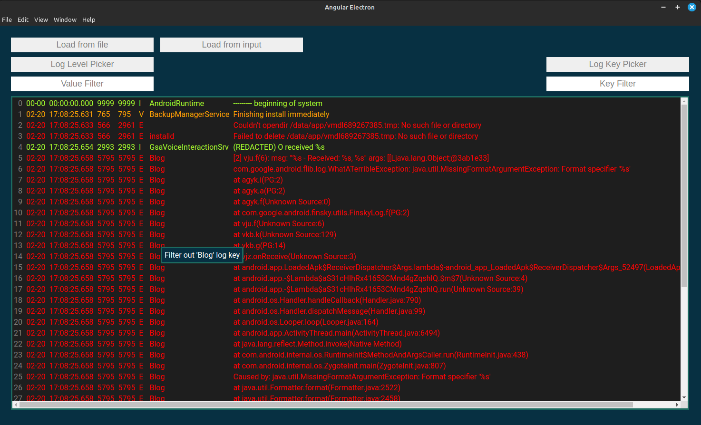

# Android log viewer

   
Android Log viewer is a tool used to load existing android log files and view them with a bit of power on your hands.
It is written in Typescript using Electron + Angular using [angular-electron](https://github.com/maximegris/angular-electron) as a base project

## Running

### build app

`npm run electron:build`

### web version

`npm run ng:serve`

### app version

`npm run electron:local`

## Features are

- Filter logs by level/ log key/ log message content
- Colored and aligned log view
- Load logs from file or clipboard
- Ability to easily exclude log key by right clicking on the log line
- Simple search in log lines

## Features to add

- Increase app performance when bigger log file is opened (~1k lines already slows it down a notch)
- Add persistent/global key excludes for always irrelevant log keys
- Allow opening file using this app (Open with...)
- Add latest Android Studio log parsing
- Add real time log viewing from device
- Show/ hide specific columns of logs (like date, processId and etc.)
- Refactor core log view module to be an angular library (potential to add to other angular projects)
- Add more styles
